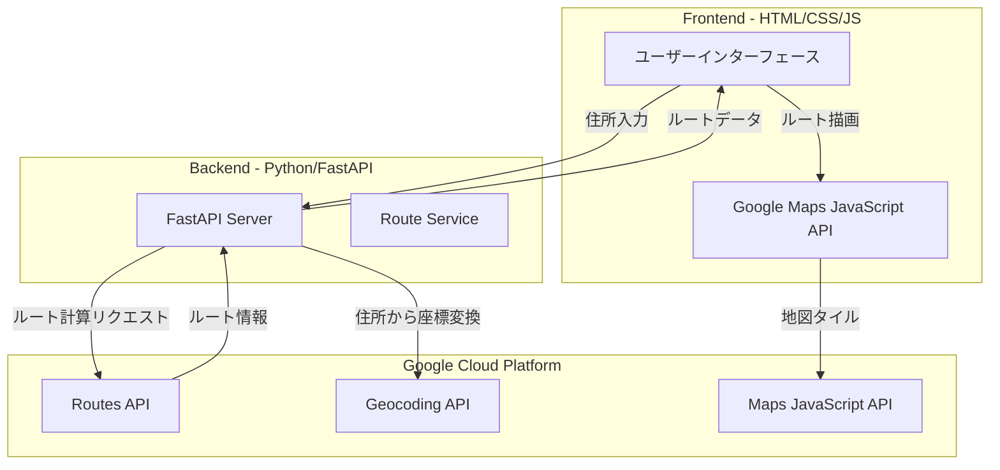

# GCP Routes API 車ルート表示Webアプリ設計

## システムアーキテクチャ



## GCPで必要なAPI

| API | 用途 |

|-----|------|

| Routes API | 車のルート計算、移動時間・距離の取得 |

| Maps JavaScript API | 地図の表示、ルートのポリライン描画 |

| Geocoding API | 住所・場所名から緯度経度への変換 |

## ディレクトリ構成

```
GCP_RouteAPI/
├── devbox.json              # devbox設定ファイル
├── devbox.lock              # devbox依存関係ロック（自動生成）
├── backend/
│   ├── main.py              # FastAPIアプリケーション
│   ├── requirements.txt     # Python依存関係
│   └── .env.example         # 環境変数テンプレート
├── frontend/
│   ├── index.html           # メインHTML
│   ├── css/
│   │   └── style.css        # スタイルシート
│   └── js/
│       └── app.js           # アプリケーションロジック
├── .gitignore               # Git除外設定
└── README.md                # セットアップ手順
```

## devbox環境設定

devboxを使用してPythonと開発ツールを管理します。

**devbox.jsonの内容:**

```json
{
  "$schema": "https://raw.githubusercontent.com/jetify-com/devbox/main/.schema/devbox.schema.json",
  "packages": [
    "python@3.12",
    "python312Packages.pip"
  ],
  "shell": {
    "init_hook": [
      "echo 'Welcome to GCP Routes API project!'",
      "python --version"
    ],
    "scripts": {
      "install": "pip install -r backend/requirements.txt",
      "backend": "cd backend && uvicorn main:app --reload --host 0.0.0.0 --port 8000",
      "frontend": "cd frontend && python -m http.server 3000"
    }
  }
}
```

**使用方法:**

```bash
# 開発環境に入る
devbox shell

# 依存関係のインストール
devbox run install

# バックエンドサーバー起動（ポート8000）
devbox run backend

# フロントエンドサーバー起動（ポート3000）
devbox run frontend
```

## 実装詳細

### 1. バックエンド (Python/FastAPI)

**主要エンドポイント:**

- `POST /api/route` - ルート計算
  - 入力: 出発地住所、目的地住所
  - 出力: ルートのポリライン、距離、所要時間

- `GET /api/geocode` - 住所から座標変換
  - 入力: 住所文字列
  - 出力: 緯度、経度

**技術的ポイント:**

- `python-dotenv`で環境変数からAPIキーを読み込み
- `httpx`でGCP APIへの非同期リクエスト
- CORSミドルウェアでフロントエンドからのアクセスを許可
- Routes APIリクエストには`X-Goog-FieldMask`ヘッダーでレスポンスフィールドを指定

### 2. フロントエンド (HTML/CSS/JS)

**UI構成:**

- 出発地・目的地の入力フォーム
- ルート検索ボタン
- Google Maps埋め込み地図
- 移動時間・距離の結果表示パネル

**技術的ポイント:**

- Google Maps JavaScript API v3を使用
- `google.maps.Polyline`でルートを描画
- `google.maps.encoding.decodePath()`でエンコード済みポリラインをデコード
- 日本向けに`language=ja`と`region=JP`を設定

### 3. Routes APIリクエスト形式

```json
{
  "origin": {
    "location": {
      "latLng": { "latitude": 35.6812, "longitude": 139.7671 }
    }
  },
  "destination": {
    "location": {
      "latLng": { "latitude": 35.6586, "longitude": 139.7454 }
    }
  },
  "travelMode": "DRIVE",
  "routingPreference": "TRAFFIC_AWARE",
  "languageCode": "ja",
  "regionCode": "JP"
}
```

## GCPセットアップ手順

1. Google Cloud Consoleでプロジェクト作成
2. 以下のAPIを有効化:

   - Routes API
   - Maps JavaScript API
   - Geocoding API

3. APIキーを2つ作成:

   - バックエンド用（Routes API, Geocoding API用、IPアドレス制限推奨）
   - フロントエンド用（Maps JavaScript API用、HTTPリファラー制限推奨）

4. 請求先アカウントの設定（月$200の無料クレジットあり）

## セキュリティ考慮事項

- バックエンドAPIキーは環境変数で管理し、gitignoreに`.env`を追加
- フロントエンドAPIキーはHTTPリファラー制限を設定
- 本番環境ではHTTPSを使用
