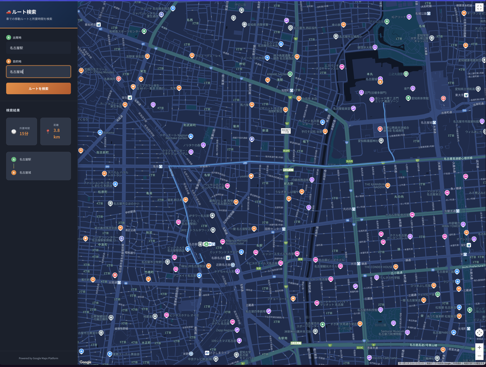

# GCP Routes API - 車ルート検索アプリ

Google Cloud Platform の Routes API を使用して、特定地点間での車の移動ルートと移動時間を地図上に表示するWebアプリケーションです。

# 画面のサンプル



## 機能

- 住所・場所名での出発地・目的地の入力
- 車での移動ルートを地図上に表示
- 移動距離と所要時間の表示
- リアルタイム交通状況を考慮したルート計算

## 技術スタック

### バックエンド
- Python 3.12
- FastAPI
- httpx（非同期HTTPクライアント）

### フロントエンド
- HTML5 / CSS3 / JavaScript（バニラ）
- Google Maps JavaScript API

### 開発環境
- devbox（Nix ベースの開発環境マネージャー）

## 必要なGCP API

以下のAPIをGoogle Cloud Consoleで有効化してください：

| API | 用途 |
|-----|------|
| Routes API | ルート計算、移動時間・距離の取得 |
| Maps JavaScript API | 地図の表示 |
| Geocoding API | 住所から緯度経度への変換 |

## セットアップ

### 1. GCPプロジェクトの設定

1. [Google Cloud Console](https://console.cloud.google.com/) にアクセス
2. 新しいプロジェクトを作成（または既存のプロジェクトを選択）
3. 「APIとサービス」→「ライブラリ」から以下のAPIを有効化：
   - Routes API
   - Maps JavaScript API
   - Geocoding API
4. 「APIとサービス」→「認証情報」からAPIキーを作成

### 2. APIキーの制限設定（推奨）

**バックエンド用APIキー:**
- 「APIの制限」で Routes API と Geocoding API のみ許可
- 「アプリケーションの制限」でIPアドレスを制限（本番環境向け）

**フロントエンド用APIキー:**
- 「APIの制限」で Maps JavaScript API のみ許可
- 「アプリケーションの制限」でHTTPリファラーを制限
  - 開発時: `http://localhost:3000/*`
  - 本番時: 実際のドメイン

### 3. 開発環境のセットアップ

```bash
# プロジェクトディレクトリに移動
cd GCP_RouteAPI

# devbox シェルに入る
devbox shell

# Python依存関係をインストール
devbox run install
```

### 4. 環境変数の設定

```bash
# バックエンドの環境変数ファイルを作成
cp backend/.env.example backend/.env

# .env ファイルを編集してAPIキーを設定
# GCP_API_KEY=your_actual_api_key_here
```

### 5. フロントエンドのAPIキー設定

`frontend/index.html` を編集し、`YOUR_MAPS_API_KEY` を実際のAPIキーに置き換えてください：

```html
<script>
    window.MAPS_API_KEY = 'your_actual_maps_api_key_here';
    window.BACKEND_URL = 'http://localhost:8000';
</script>
<script async defer
    src="https://maps.googleapis.com/maps/api/js?key=your_actual_maps_api_key_here&language=ja&region=JP&libraries=geometry&callback=initMap">
</script>
```

## 起動方法

### バックエンドサーバー

```bash
# ターミナル1
devbox shell
devbox run backend
```

バックエンドは http://localhost:8000 で起動します。

### フロントエンドサーバー

```bash
# ターミナル2
devbox shell
devbox run frontend
```

フロントエンドは http://localhost:3000 で起動します。

## 使い方

1. ブラウザで http://localhost:3000 にアクセス
2. 「出発地」に出発地点の住所や場所名を入力（例: 東京駅）
3. 「目的地」に目的地の住所や場所名を入力（例: 横浜駅）
4. 「ルートを検索」ボタンをクリック
5. 地図上にルートが表示され、所要時間と距離が表示されます

## API エンドポイント

### ヘルスチェック

```
GET /
```

### ルート計算

```
POST /api/route
Content-Type: application/json

{
  "origin": "東京駅",
  "destination": "横浜駅"
}
```

レスポンス:
```json
{
  "distance": "28.5 km",
  "duration": "35分",
  "polyline": "encoded_polyline_string",
  "origin_coords": { "latitude": 35.6812, "longitude": 139.7671 },
  "destination_coords": { "latitude": 35.4657, "longitude": 139.6223 }
}
```

### ジオコーディング

```
GET /api/geocode?address=東京駅
```

レスポンス:
```json
{
  "address": "日本、〒100-0005 東京都千代田区丸の内１丁目",
  "latitude": 35.6812,
  "longitude": 139.7671
}
```

## プロジェクト構成

```
GCP_RouteAPI/
├── devbox.json              # devbox設定
├── backend/
│   ├── main.py              # FastAPIアプリケーション
│   ├── requirements.txt     # Python依存関係
│   ├── .env.example         # 環境変数テンプレート
│   └── .env                 # 環境変数（git管理外）
├── frontend/
│   ├── index.html           # メインHTML
│   ├── css/
│   │   └── style.css        # スタイルシート
│   └── js/
│       └── app.js           # アプリケーションロジック
├── .gitignore
└── README.md
```

## トラブルシューティング

### "GCP_API_KEY is not configured" エラー

- `backend/.env` ファイルが存在するか確認
- `GCP_API_KEY` が正しく設定されているか確認

### 地図が表示されない

- フロントエンドの `YOUR_MAPS_API_KEY` が実際のAPIキーに置き換えられているか確認
- ブラウザの開発者ツールでエラーを確認
- Maps JavaScript API が有効化されているか確認

### ルートが見つからない

- 入力した住所が正しいか確認
- 日本国内の住所を使用しているか確認
- Routes API が有効化されているか確認

## ライセンス

MIT License

## 参考リンク

- [Google Routes API ドキュメント](https://developers.google.com/maps/documentation/routes)
- [Google Maps JavaScript API ドキュメント](https://developers.google.com/maps/documentation/javascript)
- [Google Geocoding API ドキュメント](https://developers.google.com/maps/documentation/geocoding)
- [devbox ドキュメント](https://www.jetify.com/devbox/docs/)
